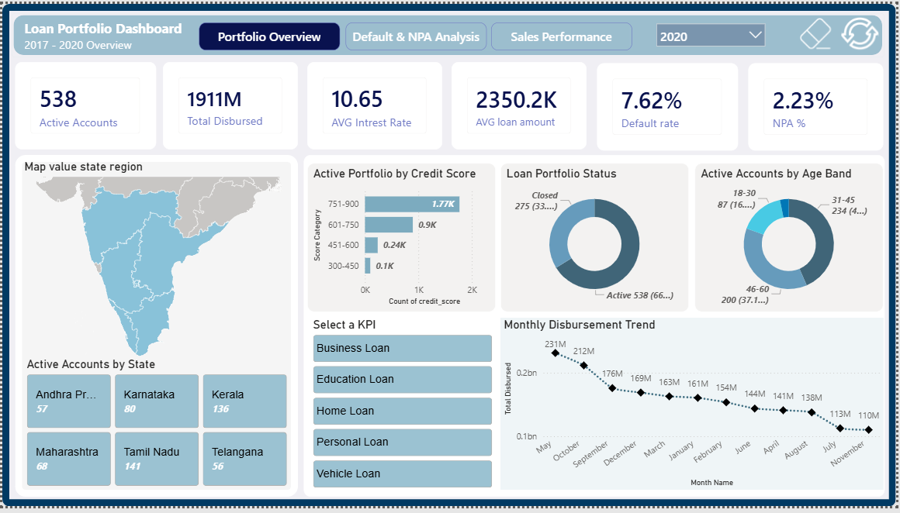
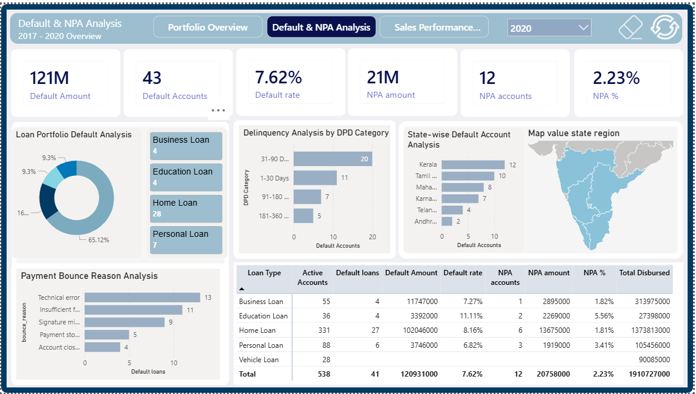
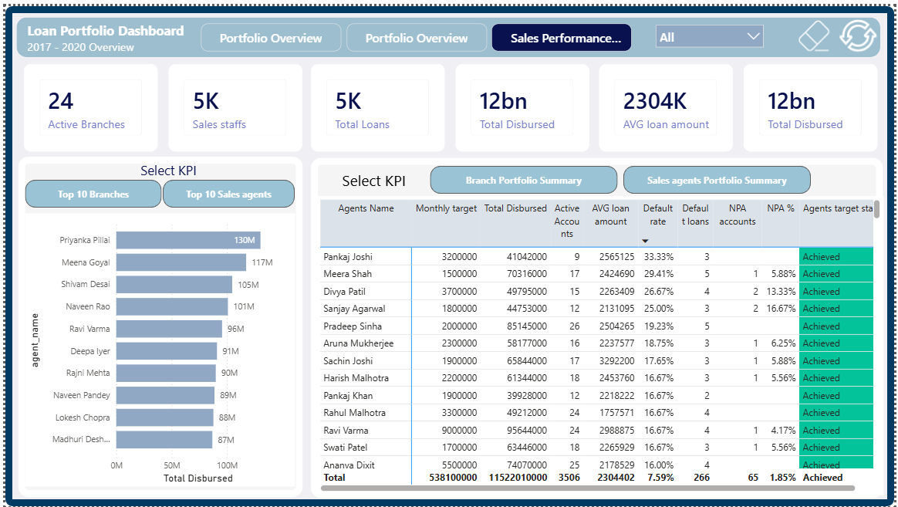

# SQL + Power BI Loan Portfolio Analysis | Credit Risk Dashboard

## Dashboard Preview

### Portfolio Overview

### Default & NPA Analysis

### Sales Performance Analysis

---

# Project Overview

An end-to-end **Loan Portfolio Analytics Dashboard** developed using **MySQL and Power BI** to analyze loan performance, credit risk, defaults, NPA trends, and sales performance.

The project transforms raw loan data into actionable insights for monitoring portfolio health and supporting data-driven lending decisions.

# Tech Stack

- **Database:** MySQL  
- **Visualization:** Power BI  
- **Data Transformation:** Power Query  
- **Analytics:** DAX Measures & Calculated Columns  
- **Data Modelling:** Power BI Relationship Modelling  

# Data Preparation

- Loaded loan portfolio data into MySQL database
- Performed data cleaning and validation
- Checked duplicates and missing values
- Standardized data formats and categories
- Created SQL views for reporting
- Connected MySQL views with Power BI

# SQL Views Created

- Loan View
- Customer View
- Payment View
- Branch View
- Sales Agent View

# Dashboard Analysis

## 1. Portfolio Overview

Analyzes overall loan portfolio performance:

- Total Active Loan Accounts
- Total Disbursed Amount
- Average Loan Amount
- Interest Rate Analysis
- Default Rate
- NPA Percentage
- State-wise Portfolio Distribution
- Credit Score Analysis
- Monthly Disbursement Trends

## 2. Default & NPA Analysis

Focuses on credit risk and delinquency monitoring:

- Default Amount
- Default Accounts
- NPA Analysis
- DPD Bucket Analysis
- Loan Type Risk Analysis
- Bounce Reason Analysis
- State-wise Default Trends

## 3. Sales Performance Analysis

Analyzes business and sales contribution:

- Branch Performance
- Sales Agent Performance
- Loan Disbursement Analysis
- Target Achievement
- Agent-wise Risk Performance

# Skills Demonstrated

- SQL Database Management
- Data Cleaning & Transformation
- SQL View Creation
- Power BI Dashboard Development
- DAX Calculations
- Credit Risk Analytics
- Business Intelligence Reporting
